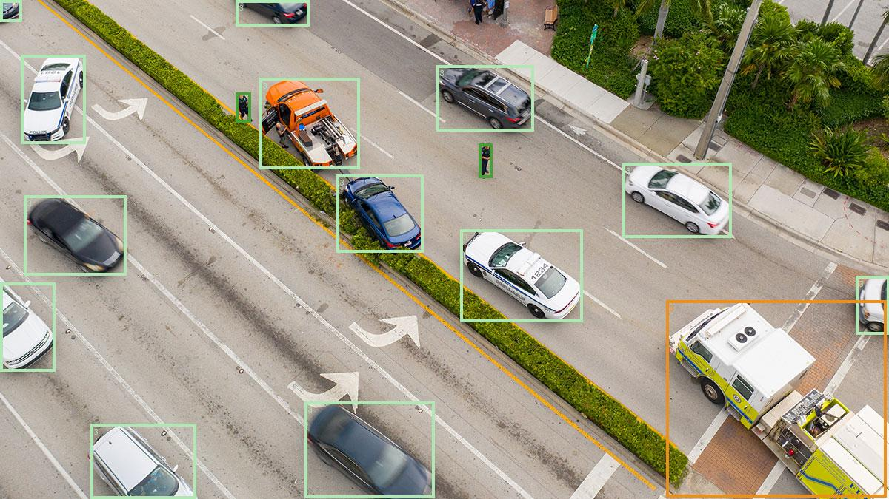
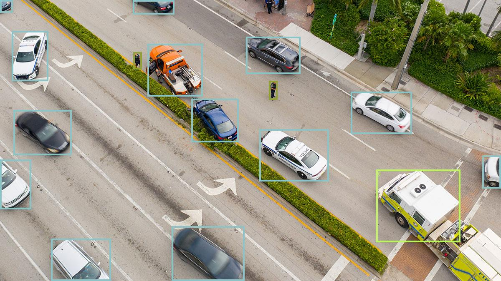

# RF-DETR with ONNX

[](https://huggingface.co/PierreMarieCurie/rf-detr-onnx/tree/main)


This repository is a fork of the original work by [PierreMarieCurie](https://github.com/PierreMarieCurie/rf-detr-onnx), reworked and organized into a modular structure with additional features like manual device selection and performance metrics. Special thanks to [PierreMarieCurie](https://github.com/PierreMarieCurie) for the initial implementation and model conversions.

RF-DETR is a transformer-based object detection and instance segmentation architecture developed by Roboflow. For more details on the model, please refer to the impressive work by the Roboflow team [here](https://github.com/roboflow/rf-detr/tree/main).

| Original Image | Torch Reference | ONNX Inference Result |
|----------------|-----------------|-----------------------|
| <p align="center"></p> | <p align="center"></p> | <p align="center"></p> |

## Project Structure

The project is organized within the `python/` directory:

- `python/inference.py`: High-level script for running inference on images.
- `python/run_validation.sh`: Master script for end-to-end model preparation and validation.
- `python/modules/`: Core logic and modules.
  - `model.py`: High-level detection model class (`RFDETRModel`).
  - `onnx_runtime.py`: ONNX Runtime session management.
  - `utils.py`: Common utility functions.
  - `export_roboflow.py`: Script to convert RF-DETR checkpoints to ONNX via Roboflow API.
- `python/tests/`: Quality assurance and validation tools.
  - `prepare_models.py`: Handles weight download and ONNX export.
  - `generate_torch_results.py`: Reference result generator (PyTorch).
  - `generate_onnx_results.py`: Target result generator (ONNX).
  - `test_val.py`: Accuracy comparison test suite.
- `output/`: Default directory for inference results.

## Installation

First, clone the repository:

```bash
git clone https://github.com/imessam/rf-detr-onnx.git
cd rf-detr-onnx/python
```

### Using uv

First, install [uv](https://docs.astral.sh/uv/) if you haven't already:

- **Lightweight Inference (CPU)**:
  ```bash
  uv sync
  ```
- **GPU Acceleration**:
  ```bash
  uv sync --extra gpu
  ```
- **Full Development (Export & Testing)**:
  ```bash
  uv sync --extra export --extra test
  ```

## Validation & Testing

We provide a fully automated validation pipeline that ensures the exported ONNX model matches the original PyTorch model's accuracy.

### Run Full Pipeline
The master script handles dependency syncing, model preparation, result generation, and accuracy comparison:

```bash
./run_validation.sh nano
```

## Converting 

To export your own fine-tuned RF-DETR model to ONNX, use the `export_roboflow.py` script. You'll need the `[export]` extra:

```bash
uv sync --extra export
uv run python modules/export_roboflow.py --weights path/to/your_model.pth --model-type nano
```

#### Export Parameters
| Argument | Type | Default | Description |
|----------|------|---------|-------------|
| `--weights` | `str` | **Required** | Path to the `.pth` checkpoint file. |
| `--model-type` | `str` | `nano` | Architecture type (`nano`, `small`, `base`, `medium`, `large`). |
| `--output-dir` | `str` | `models/` | Directory for the exported model. |
| `--opset` | `int` | `17` | ONNX opset version. |
| `--no-simplify`| `flag`| `False` | Disable model simplification. |

## Inference

### Inference Script

```bash
# Run on CPU (default)
uv run python inference.py --model tests/test_models/inference_model.sim.onnx --image ../assets/drone.jpg

# Run on GPU
uv run python inference.py --model tests/test_models/inference_model.sim.onnx --image ../assets/drone.jpg --device gpu
```

### Programmatic Usage

```python
from modules.model import RFDETRModel

# Initialize the model
model = RFDETRModel("path/to/model.onnx", device="cpu")

# Run inference
scores, labels, boxes, masks = model.predict("path/to/image.jpg")

# Visualize results
model.save_detections("path/to/image.jpg", boxes, labels, masks, "output/result.jpg")
```

## License

This repository is licensed under the MIT License. See [LICENSE](LICENSE) for more details.

However, some parts of the code are derived from Roboflow software. Below are the details:

- **Apache License 2.0** ([reference](https://www.apache.org/licenses/LICENSE-2.0)): RF-DETR models and pretrained weights (except `rfdetr-xlarge` and `rfdetr-2xlarge`) and all `rfdetr` Python package.
- **Platform Model License 1.0 (PML-1.0)** ([reference](https://roboflow.com/platform-model-license-1-0)): `rfdetr-xlarge` and `rfdetr-2xlarge` models and pretrained weights.

More information about Roboflow model licensing [here](https://roboflow.com/licensing).

## Acknowledgements
- Thanks to the **Roboflow** team and everyone involved in the development of RF-DETR, particularly for sharing a state-of-the-art model under a permissive free software license.