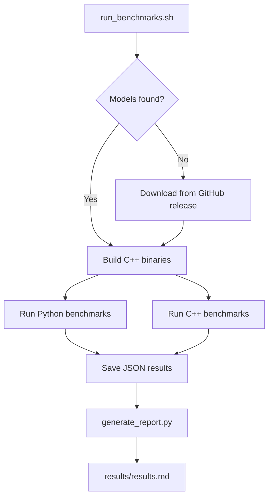

# Benchmarks

The `benchmarks/` directory contains an automated performance measurement suite that evaluates both the Python and C++ implementations across CPU and GPU providers.

---

## How It Works

1. **Discovers models** — scans `models/` for all `.onnx` files
2. **Downloads models** — fetches from the GitHub release if no models are found
3. **Builds C++** — compiles the C++ binaries if needed
4. **Runs inference** — iterates over all models × all providers (CPU, CUDA, TensorRT)
5. **Generates report** — aggregates JSON results into `benchmarks/results/results.md`

---

## Running Benchmarks

```bash
cd benchmarks
./run_benchmarks.sh -n 10 -v
```

### Options

| Option | Default | Description |
|--------|---------|-------------|
| `-n <int>` | `10` | Number of iterations per run |
| `-c <float>` | `2.0` | Cooldown period in seconds between runs |
| `-s <float>` | `0.1` | Sleep delay between per-image iterations |
| `-v` | Off | Enable verbose per-iteration output |
| `-u <url>` | *(GitHub release)* | Custom URL to download ONNX models |

---

## Example Output

Results are saved to `benchmarks/results/results.md`. The report shows:

- **System Information** — CPU, RAM, and GPU specifications
- Model name and architecture
- Implementation (Python / C++)
- Provider used (TensorRT / CUDA / CPU)
- Preprocess / ORT run / postprocess timings
- Average FPS

### Sample System Information

The report begins with a table of your hardware specs:

| Component | Details |
| :--- | :--- |
| **CPU** | AMD Ryzen 5 7600 6-Core Processor |
| **CPU Cores / Threads** | 6 cores / 12 threads |
| **RAM** | 7.3 GB |
| **GPU** | NVIDIA GeForce RTX 4060 (8.0 GB VRAM, driver 591.74) |

### Sample Results (RF-DETR Nano, 384×384)

| Provider | Preprocess (ms) | ORT Run (ms) | Postprocess (ms) | FPS |
|----------|----------------|--------------|-----------------|-----|
| TensorRT | 2.1 | 4.3 | 1.8 | ~120 |
| CUDA | 2.1 | 12.5 | 1.8 | ~57 |
| CPU | 2.1 | 95.0 | 1.8 | ~10 |

!!! note
    Results vary by hardware (CPU model, GPU generation, system load). The table above is an illustrative example from a laptop with an RTX 40-series GPU.

---

## Generating a Report Standalone

If you already have benchmark result JSON files and just want to regenerate the Markdown report:

```bash
cd benchmarks
python generate_report.py --results-dir results/ --output results/results.md
```

---

## Benchmarking Architecture


