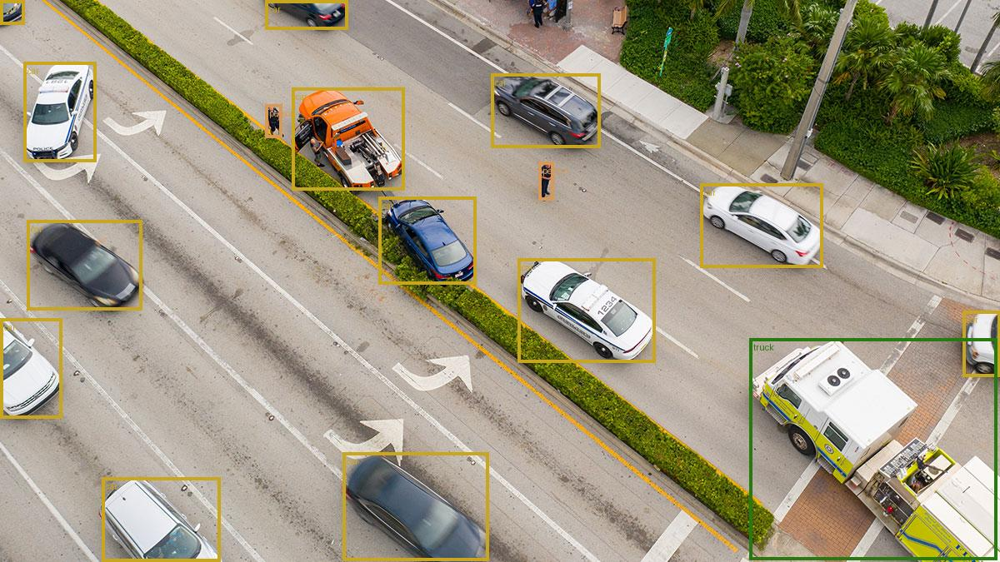

# RF-DETR Validation Report

## Summary Statistics
- **Average IOU**: 0.9354
- **Average Speedup (ONNX/Torch)**: 8.62x

## Assets Table
| Asset | Torch (ms) | ONNX (ms) | Speedup | Avg IOU | Label Acc | Status |
| :--- | :---: | :---: | :---: | :---: | :---: | :---: |
| drone.jpg | 1175.00 | 136.32 | 8.62x | 0.9354 | 100.0% | ✅ PASS |

## Detailed Results
### drone.jpg
- **Status**: PASS
- **Avg IOU**: 0.9354
- **Speedup**: 8.62x

#### Bounding Box Comparison (Greedy Matching)
We use a greedy matching algorithm (IOU > 0.4) to pair detections from PyTorch and ONNX models.

| Match # | Torch Class | ONNX Class | IOU | Status |
| :--- | :--- | :--- | :---: | :---: |
| 1 | car | car | 0.9911 | ✅ OK |
| 2 | car | car | 0.9829 | ✅ OK |
| 3 | car | car | 0.9585 | ✅ OK |
| 4 | car | car | 0.9946 | ✅ OK |
| 5 | car | car | 0.9901 | ✅ OK |
| 6 | car | car | 0.9921 | ✅ OK |
| 7 | car | car | 0.9840 | ✅ OK |
| 8 | car | car | 0.9932 | ✅ OK |
| 9 | car | car | 0.9709 | ✅ OK |
| 10 | person | person | 0.8609 | ⚠️ DIFF |
| 11 | car | car | 0.9932 | ✅ OK |
| 12 | car | car | 0.9891 | ✅ OK |
| 13 | truck | truck | 0.4420 | ⚠️ DIFF |
| 14 | person | person | 0.9175 | ✅ OK |
| 15 | car | car | 0.9524 | ✅ OK |
| 16 | car | car | 0.9533 | ✅ OK |

| Torch Annotated | ONNX Annotated |
| :---: | :---: |
|  |  |
